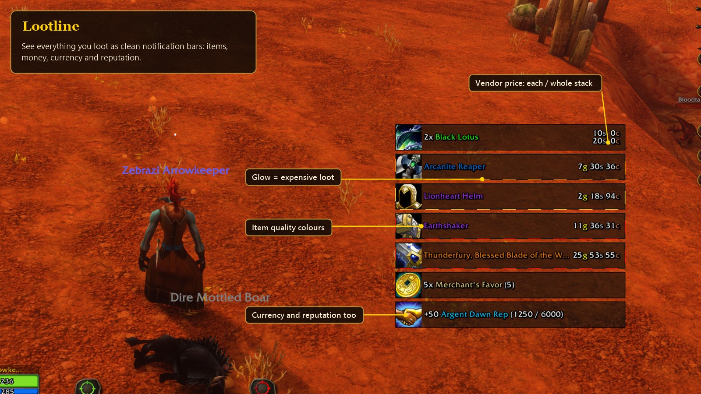
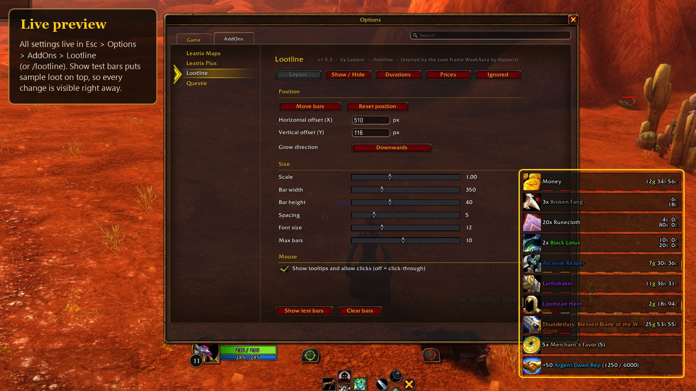

# Lootline

A World of Warcraft: Forever addon that shows what you loot as a small stack of bars: items, gold, currencies and reputation, with vendor prices.

## Install

Download the latest release (or the zip from CurseForge) and put the `Lootline` folder into
`World of Warcraft\_classic_beta_\Interface\AddOns`, so that you end up with `AddOns\Lootline\Lootline.toc`.
Restart the game.

Settings are in Esc > Options > AddOns > Lootline, or type `/lootline`. `/lootline help` lists all commands.

## What it does

- One bar per item you pick up, with icon, quality colour, stack count and vendor price
- Auction prices if you use Auctionator
- Glowing border for expensive loot, with your own price levels
- Gold, currencies and reputation in the same list
- Optional faster auto loot without the loot window
- Gamepad ready: works with the gamepad interface style
- Filters by type, quality and price, and an ignore list (Shift+Right-click a bar)
- Adjustable position, size, font, durations and stack direction

## Repository

- `Lootline/` - the addon itself, this is what goes into the AddOns folder
- `tests/` - tests that run the addon against a mock of the WoW API
- `images/` - logo and screenshots

### Running the tests

The tests run the Lua code in a browser with [fengari](https://github.com/fengari-lua/fengari-web), so no Lua install is needed.

1. Start the small local file server from the repository root:
   `powershell -ExecutionPolicy Bypass -File tests\serve.ps1`
2. Open http://localhost:8765/tests/harness.html?test=all

Every test file ends with `RESULT: 0 failure(s)` when everything passes.

## Credits

The idea and the look come from the "Loot Frame" WeakAura by Hypocrit: https://wago.io/-IWPKK1il.
Lootline is written from scratch and contains no code from it.

## Support

If you like Lootline and want to buy me a coffee:

## License

MIT, see [LICENSE](LICENSE). The sound file `Lootline/Media/wilhelm.ogg` is not covered by the license.
